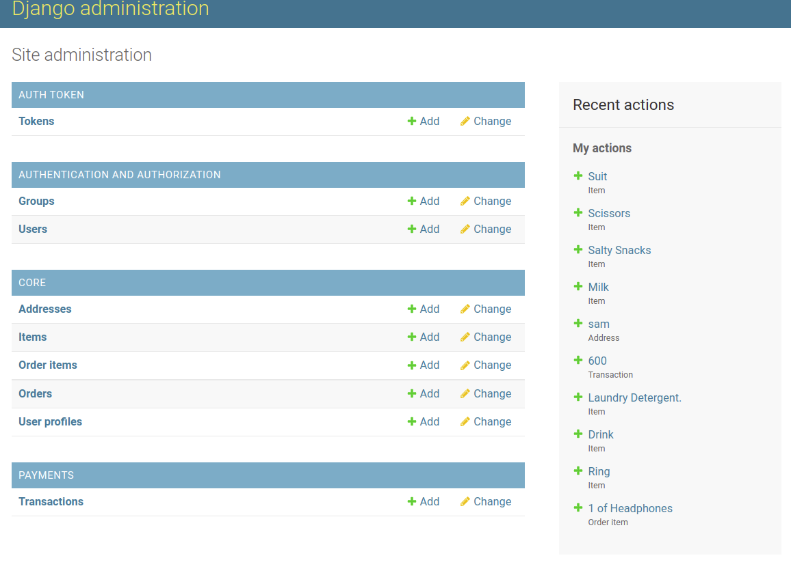

# MEGA-DALLA

#### By Wayne Musungu, Edah Chepngetich, Victor Makori, Haimana Uta, Clinton Wambungu and James Musembi 

## Table of Content

- [Description](#Description)
- [Installation Requirement](#Installation)
- [Technologies Used](#Technologies-Used)
- [Reference](#Reference)
- [Licence](#LICENSE)
- [Authors Info](#Author-Info)

## Description 

Mega Dalla is on a mission to make shopping well effortless for everyone, everywhere. Our service is connect vendors with customers around the globe and enable vendors to reach more customers and biuld their business.

#### Technologies used
    - Python 3.8
    - Angular
    - HTML
    - CSS
    - Bootstrap 5
    - Heroku
    - Postgresql
    - Django, Django Rest Framework

[Go Back to the top](#MEGA-DALLA)

# Installation

### Requirements

Either a computer,phone,tablet or an Ipad
Make sure you have access to internet
Click on the live link in the about section 

#### Install dependancies
Install dependancies that will create an environment for the app to run
`pip install -r requirements.txt`

#### Create the Database
In a new terminal, open the postgresql shell with `psql`.
```bash
CREATE DATABASE dallas; 

#### Make and run migrations
```bash
python3.8 manage.py makemigrations && python3.8 manage.py migrate
```

#### Run the app
```bash
python3.8 manage.py runserver
```

Open [localhost:8000](http://127.0.0.1:8000/)

## Running the tests

Run test using the following command

```
 ./manage.py test dallas
```

[Go Back to the top](#MEGA-DALLA)

##### Link to Live Site

# License

Copyright (c) 2022 WayneMusungu

Permission is hereby granted, free of charge, to any person obtaining a copy
of this software and associated documentation files (the "Software"), to deal
in the Software without restriction, including without limitation the rights
to use, copy, modify, merge, publish, distribute, sublicense, and/or sell
copies of the Software, and to permit persons to whom the Software is
furnished to do so, subject to the following conditions:

The above copyright notice and this permission notice shall be included in all
copies or substantial portions of the Software.

THE SOFTWARE IS PROVIDED "AS IS", WITHOUT WARRANTY OF ANY KIND, EXPRESS OR
IMPLIED, INCLUDING BUT NOT LIMITED TO THE WARRANTIES OF MERCHANTABILITY,
FITNESS FOR A PARTICULAR PURPOSE AND NONINFRINGEMENT. IN NO EVENT SHALL THE
AUTHORS OR COPYRIGHT HOLDERS BE LIABLE FOR ANY CLAIM, DAMAGES OR OTHER
LIABILITY, WHETHER IN AN ACTION OF CONTRACT, TORT OR OTHERWISE, ARISING FROM,
OUT OF OR IN CONNECTION WITH THE SOFTWARE OR THE USE OR OTHER DEALINGS IN THE
SOFTWARE.

## Authors Info

* **Wayne Musungu** - [WayneMusungu](https://github.com/WayneMusungu)

* **Clinton Wambugu** - [Clinton-dev](https://github.com/Clinton-dev)

* **James Musembi** - [JamesMusembi](https://github.com/JamesMusembi)

* **Victor Ondari** - [Victor Ondari](https://github.com/VictorOndari)

* **Haimana Uta** - [haimy254](https://github.com/haimy254)

[Go Back to the top](#MEGA-DALLA)


# Project layout 

## Admin Dashboard Credentials
## USERNAME

 ## PASSWORD


# ADMIN Dashbord


# HOME PAGE


### Register
